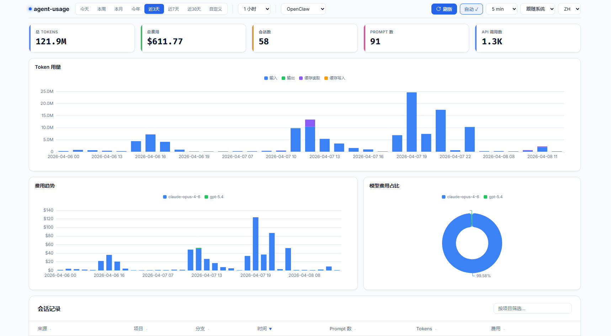

# agent-usage

[](https://go.dev)
[](LICENSE)
[]()
[](https://ghcr.io/briqt/agent-usage)

轻量级、跨平台的 AI 编程工具用量与费用追踪器。  
单二进制 + SQLite —— 零基础设施依赖。

**[English](README.md)**

统一采集 Claude Code、Codex、OpenClaw、OpenCode、kiro、Pi、Hermes Agent 的本地会话数据，自动计算费用，通过 Web 仪表板展示 token 用量、费用趋势和会话明细。



## 特性

- 📁 **本地文件解析** —— 直接读取 Claude Code、Codex CLI、OpenClaw、Pi 的会话文件、OpenCode 的 SQLite 数据库、kiro 的会话/数据库文件和 Hermes Agent 的 state 数据库
- 💰 **自动费用计算** —— 从 [litellm](https://github.com/BerriAI/litellm) 获取模型价格，价格更新后自动回填历史记录
- 🗄️ **SQLite 存储** —— 单文件、零运维、数据可修正
- 📊 **Web 仪表板** —— 暗色主题 UI，ECharts 图表：费用分布、token 趋势、会话列表
- 🔄 **增量扫描** —— 监听新会话，自动去重
- 📦 **单二进制** —— `go:embed` 将 Web UI 打包进可执行文件
- 🖥️ **跨平台** —— Linux、macOS、Windows

## 快速开始（Docker）

```bash
# 一条命令启动
mkdir -p ./data && docker compose up -d

# 打开仪表板
open http://localhost:9800
```

默认 `docker-compose.yml` 不挂载任何 agent 数据目录。请根据你实际安装的 agent 取消对应 volume 的注释（Claude Code、Codex、OpenClaw、OpenCode、kiro、Pi、Hermes）。数据持久化在 `./data/` 目录。

> **注意：** 只启用你实际安装的 agent 的挂载。Docker 会以 root 身份自动创建不存在的宿主机目录，这会干扰 `npx skills add` 等通过目录是否存在来检测已安装 agent 的工具。

容器默认使用 `config.docker.yaml`（绑定 `0.0.0.0`，数据存储在 `/data/`）。如需自定义配置，挂载你自己的配置文件：

```yaml
# 在 docker-compose.yml 中取消注释：
volumes:
  - ./config.yaml:/etc/agent-usage/config.yaml:ro
```

UID/GID 权限及本地构建详见 [Docker 详情](#docker-详情)。

## 在 Agent 对话中查询用量

Skill 可独立使用，无需安装或运行 agent-usage 服务 —— 直接解析本地会话文件即可工作。如果检测到 agent-usage 服务在运行，自动切换到 API 查询以获取更精确的费用数据。

```bash
# 通过 vercel-labs/skills 安装，支持 Claude Code、Cursor、kiro 等 40+ 种 agent
npx skills add briqt/agent-usage -y
```

安装后试试：`查下 agent usage`、`agent usage 统计` 或 `check agent usage`。详见 [`skills/agent-usage/SKILL.md`](skills/agent-usage/SKILL.md)。

## 配置

```yaml
server:
  port: 9800
  bind_address: "127.0.0.1"  # 远程访问请改为 "0.0.0.0"

collectors:
  claude:
    enabled: true
    paths:
      - "~/.claude/projects"
    scan_interval: 60s
  codex:
    enabled: true
    paths:
      - "~/.codex/sessions"
    scan_interval: 60s
  openclaw:
    enabled: true
    paths:
      - "~/.openclaw/agents"
    scan_interval: 60s
  opencode:
    enabled: true
    paths:
      - "~/.local/share/opencode/opencode.db"
    scan_interval: 60s
  kiro:
    enabled: true
    paths:
      - "~/.local/share/kiro-cli/data.sqlite3"
    scan_interval: 60s
  hermes:
    enabled: true
    paths:
      - "~/.hermes"
    scan_interval: 60s

storage:
  path: "./agent-usage.db"

pricing:
  sync_interval: 1h  # 从 GitHub 获取价格；如失败请设置 HTTPS_PROXY 环境变量
```

配置文件搜索顺序：`--config` 参数 > `/etc/agent-usage/config.yaml` > `./config.yaml`。

## 从源码编译

```bash
# 克隆
git clone https://github.com/briqt/agent-usage.git
cd agent-usage

# 编译
go build -o agent-usage .

# 编辑配置
cp config.yaml config.local.yaml
# 按需调整路径

# 运行
./agent-usage

# 打开仪表板
open http://localhost:9800
```

## 支持的数据源

| 来源 | 会话路径 | 格式 |
|------|---------|------|
| [Claude Code](https://docs.anthropic.com/en/docs/claude-code) | `~/.claude/projects/<项目>/<会话>.jsonl` | JSONL |
| [Codex CLI](https://github.com/openai/codex) | `~/.codex/sessions/<年>/<月>/<日>/<会话>.jsonl` | JSONL |
| [OpenClaw](https://github.com/openclaw/openclaw) | `~/.openclaw/agents/<agentId>/sessions/<sessionId>.jsonl` | JSONL |
| [OpenCode](https://github.com/anomalyco/opencode) | `~/.local/share/opencode/opencode.db` | SQLite |
| [kiro](https://kiro.dev) | `~/.local/share/kiro-cli/data.sqlite3` | SQLite |
| [Pi](https://pi.dev) | `~/.pi/agent/sessions/<工作区>/<会话>.jsonl` | JSONL |
| [Hermes Agent](https://github.com/NousResearch/hermes-agent) | `~/.hermes/state.db` + `~/.hermes/profiles/*/state.db` | SQLite |

### 添加新数据源

每个数据源需要一个采集器：
1. 扫描会话目录中的 JSONL 文件
2. 解析条目，提取每次 API 调用的 token 用量
3. 通过存储层写入 SQLite

参考 `internal/collector/claude.go` 的实现。

## 仪表板

Web 仪表板提供：

- **吸顶控制栏** —— 时间预设、粒度、来源筛选（Claude/Codex/OpenClaw/OpenCode/kiro/Pi/Hermes）、自动刷新
- **汇总卡片** —— 总 Tokens、总费用、会话数、Prompt 数、API 调用数
- **Token 用量** —— 堆叠柱状图（输入/输出/缓存读取/缓存写入）
- **费用趋势** —— 按模型堆叠柱状图，颜色映射一致
- **模型费用占比** —— 环形图，带百分比标签
- **会话列表** —— 可排序、可筛选，展开查看模型明细
- **深色/浅色主题** —— 跟随系统，支持手动切换
- **国际化** —— 中英文
- **时区处理** —— 所有时间戳以 UTC 存储；前端根据浏览器时区自动转换日期选择器、图表 X 轴标签和会话时间显示

## 架构

```
agent-usage
├── main.go                     # 入口，编排各组件
├── config.yaml                 # 配置文件
├── internal/
│   ├── config/                 # YAML 配置加载
│   ├── collector/
│   │   ├── collector.go        # Collector 接口
│   │   ├── claude.go           # Claude Code 会话扫描
│   │   ├── claude_process.go   # Claude Code JSONL 解析
│   │   ├── codex.go            # Codex CLI JSONL 解析
│   │   ├── openclaw.go         # OpenClaw 会话扫描
│   │   ├── openclaw_process.go # OpenClaw JSONL 解析
│   │   ├── opencode.go         # OpenCode SQLite 采集器
│   │   ├── kiro.go             # kiro 扫描
│   │   ├── kiro_process.go     # kiro SQLite 解析，兼容旧 JSON/JSONL
│   │   ├── pi.go               # Pi coding agent 会话扫描
│   │   ├── pi_process.go       # Pi coding agent JSONL 解析
│   │   ├── hermes.go           # Hermes Agent state.db 扫描
│   │   └── hermes_process.go   # Hermes Agent SQLite 解析
│   ├── pricing/                # litellm 价格获取 + 计费公式
│   ├── storage/
│   │   ├── sqlite.go           # 数据库初始化 + 迁移
│   │   ├── api.go              # 查询类型 + 读取操作
│   │   ├── queries.go          # 写入操作
│   │   └── costs.go            # 费用重算 + 回填
│   └── server/
│       ├── server.go           # HTTP 服务 + REST API
│       └── static/             # 内嵌 Web UI（HTML + JS + ECharts）
└── agent-usage.db              # SQLite 数据库（运行时生成）
```

## 费用计算

仪表板和 API 只提供一个美元费用字段：`total_cost`。每条用量记录统一采用以下优先级：

1. 来源返回了大于零的费用时，直接使用该费用。
2. 否则按照互不重叠的 Token 数量乘以匹配模型的 Token 单价计算。
3. 既没有来源费用、也无法确定性匹配价格时，记录保持未计价，费用为零。

Token 计价回退使用少量内置官方覆盖表补充 Anthropic 5 分钟/1 小时缓存写入、fast mode 倍率等产品字段，并由 [LiteLLM 模型价格数据库](https://github.com/BerriAI/litellm/blob/main/model_prices_and_context_window.json) 提供广泛模型覆盖。模型只做精确匹配或 provider + 模型名匹配，不使用子字符串猜测。

```
Token 计价回退 =
       非缓存输入 × 输入价格
     + 5 分钟缓存写入 × 5 分钟缓存写入价格
     + 1 小时缓存写入 × 1 小时缓存写入价格
     + 缓存读取 × 缓存读取价格
     + 输出 × 输出价格
```

所有 Token 分量互不重叠；适用的速度与推理区域修正会在分量计价后应用。每次价格同步都会按照上述优先级重算唯一的费用字段，来源返回的费用始终优先。Codex 与其他来源一样使用 Token 单价回退，不再提供独立的 Credits 汇总。

Claude Code 使用 session + request ID + message ID 去重，因为同一次 API 返回可能重复出现在多个 content block 事件中。Kiro 无法提供精确 token，API 统计会明确标注其记录为估算。

首次升级到 v1.14 时会保留 Claude 历史数据并进行保守去重：删除零 Token 记录，并合并同一五分钟响应簇内 Token 明细完全相同的记录。会话、提示事件和扫描位点都会保留，因此源文件已经删除的历史也不会丢失。旧数据未提供缓存 TTL 时继续按基础缓存写入价计算；新采集数据会区分 5 分钟和 1 小时缓存写入。迁移可重复安全执行，但升级前仍建议备份 `agent-usage.db`。

官方依据：[Anthropic 价格](https://platform.claude.com/docs/en/about-claude/pricing)、[Anthropic Prompt Caching](https://platform.claude.com/docs/en/build-with-claude/prompt-caching)。

## API 接口

所有接口支持 `from` 和 `to`（YYYY-MM-DD）查询参数。可选：`source`（`claude`、`codex`、`openclaw`、`opencode`、`kiro`、`pi`、`hermes`）按来源筛选，`model` 按模型名筛选，`granularity`（`1m`、`30m`、`1h`、`6h`、`12h`、`1d`、`1w`、`1M`）用于时序接口。

| 接口 | 说明 |
|------|------|
| `GET /api/stats` | 汇总：唯一总费用、Token 质量、Token、会话数、Prompt 数、API 调用数 |
| `GET /api/cost-by-model` | 按模型分组的费用 |
| `GET /api/cost-over-time` | 费用时序（支持 `granularity`） |
| `GET /api/tokens-over-time` | Token 用量时序（支持 `granularity`） |
| `GET /api/sessions` | 会话列表及费用/token 汇总 |
| `GET /api/session-detail?session_id=ID` | 单个会话的模型明细 |

日期格式错误或日期范围倒置时返回 `400` JSON 错误，包含具体原因。

## 技术栈

- **Go** —— 纯 Go 实现，无需 CGO
- **SQLite** via [`modernc.org/sqlite`](https://pkg.go.dev/modernc.org/sqlite) —— 纯 Go SQLite 驱动
- **ECharts** —— 图表库
- **`go:embed`** —— 单二进制部署

## Docker 详情

预构建多架构镜像（amd64 + arm64）发布在 `ghcr.io/briqt/agent-usage`。

默认 `docker-compose.yml` 以 UID 1000 运行。如果你的用户 UID 不同，请修改 `user:` 字段：

```bash
# 查看你的 UID/GID
id -u  # 例如 1000
id -g  # 例如 1000

# 编辑 docker-compose.yml: user: "你的UID:你的GID"
```

这是必需的，因为 `~/.claude/projects` 目录权限为 700，只有对应 UID 才能读取。

### 本地构建

```bash
docker build -t agent-usage:local .

# 中国大陆用户，使用 GOPROXY 加速：
docker build --build-arg GOPROXY=https://goproxy.cn,direct -t agent-usage:local .
```

## 社区

欢迎到 [Linux.do](https://linux.do/t/topic/1922004) 参与讨论和反馈。

## 许可证

[Apache 2.0](LICENSE)
